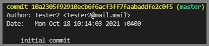

# Что такое git
***Cистема контроля версий (VCS)*** — программное обеспечение для облегчения работы с изменяющейся информацией.

* Полная история изменений каждого файла за длительный период. Это касается всех изменений, внесенных огромным количеством людей за долгие годы. Изменением считается создание и удаление файлов, а также редактирование их содержимого. Различные инструменты VCS отличаются тем, насколько хорошо они обрабатывают операции переименования и перемещения файлов. В историю также должны входить сведения об авторе, дата и комментарий с описанием цели каждого изменения. Наличие полной истории позволяет возвращаться к предыдущим версиям, чтобы проводить анализ основных причин возникновения ошибок и устранять проблемы в старых версиях программного обеспечения.
* Ветвление и слияние. Создание «веток» позволяет иметь несколько независимых друг от друга направлений разработки, а также выполнять их слияние, чтобы разработчики могли проверить, что изменения, внесенные в каждую из веток, не конфликтуют друг с другом. Многие команды разработчиков программного обеспечения создают отдельные ветки для каждой функциональной возможности, для каждого релиза либо и для того, и для другого.
* Отслеживаемость. Возможность отслеживать каждое изменение, внесенное в программное обеспечение, и связывать его с ПО для управления проектами и отслеживания ошибок. История с комментариями во время чтения кода помогает понять, что этот код делает и почему действие реализовано именно таким образом. Благодаря этому разработчики могут вносить корректные и совместимые изменения в соответствии с долгосрочным планом разработки системы.

# Подготовка репозитория
1.	Скачать и установить VS Code [отсюда](https://code.visualstudio.com/docs/?dv=win)
2.	Скачать и установить Git [по ссылке](https://git-scm.com/download/win)
3. Проверить, работает ли git с помощью команды
git --version
4. Добавить имя и email пользователя с помощью команд
git config --global user.email "email@mail.com"
git config --global user.name "User Name"

# Создание «сохранений»

**`git add`**

Команда `git add` добавляет изменение из рабочего каталога в раздел проиндексированных файлов. Она сообщает Git, что вы хотите включить изменения в конкретном файле в следующий коммит. Однако на самом деле команда `git add` не оказывает существенного влияния на репозиторий: изменения регистрируются в нем только после выполнения команды `git commit`.

Наряду с этими командами вам понадобится команда `git status`, которая показывает состояние рабочего каталога и раздела проиндексированных файлов.

    git add <file>
Проиндексировать все изменения в файле &lt;file&gt; для следующего коммита.

    git add <directory>
Проиндексировать все изменения в каталоге &lt;directory&gt; для следующего коммита.

    git add -p

# Перемещение между сохранениями

Для возврата сохранённых файлов к предыдущим версиям необходимо использовать команду `git checkout`. В аргументе команды пишется номер коммита, к которому нужно вернуться. 

В команде необязательно писать весь номер коммита, достаточно написать в аргументе только первые 4 символа.

# Журнал изменений

Чтобы получить номера коммитов используется команда `git log`. Номер коммита содержится в жёлтой строке, рядом со словом "commit", следующие 2 строки снизу содержат информацию об авторе и дате записи. Ещё ниже содержится комментарий.

# Ветки в git

Для параллельной работы над проектом несколькими людьми в git используются ветки - независимые директории, со своими журналами изменений.

Команда `git branch` позволяет отображать список существующих веток. Чтобы создать новую ветку необходимо в агрументе этой команды вписать название будущей ветки. 

Для перемещения между ветками используется команда `git checkout branch_name`, где branch_name - название ветки, в которую переместится пользователь.

По умолчанию основная ветка имеет название "master". Чтобы изменить название ветки используется команда `git branch -m old_branch new_branch`.

# Слияние веток и решение конфликтов

При слиянии веток используется команда `git merge`, в аргументе которой пишется название ветки, изменения которой вступят в силу. Изменения применяются к текущей ветке в которой находится пользователь.

Во время объединения веток могут возникнуть конфликты. Они возникают, если в сливаемых ветках произошли взаимоисключающие изменения. Например, в текстовом файле были сохранены изменения в одной и той же строке в обеих ветках. В таком случае при слиянии веток возникнет конфликт, и система предложит пользователю самостоятельно выбрать дальнейшие действия: принять изменения из исходной ветки, из входящей, из двух веток сразу или не приминять изменений.

# Удаление веток

В случае, если ветка больше не нужна, её можно удалить, добавив в комнаду `git branch` аргумент `-d branch_name`. 

# Работа с удалённым репозиторием

# Полезные ссылки

1. [Руководство по Git](https://git-scm.com/docs) - содержится информация по всем командам и прочим полезным функциям Git.
2. [Горячие клавиши VS Code](https://nikomedvedev.ru/other/vscodeshortcuts/hotkeys.html) - сочетания клавиш, облегчающие работу в редакторе исходного кода.
